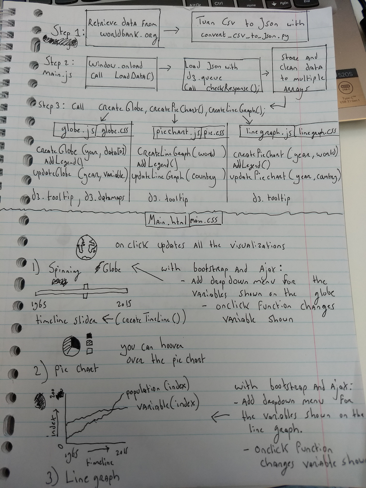

# Design Document
## *Steven Kuhnen (10305882)*
## **Agriculture and Population growth: How sustainable is the current population growth**

### Data Sources
Datasets from the World Bank (https://data.worldbank.org/indicator) will be used. All the datasets (csv-format) are user-friendly, and will thus need none to minimum editing before implantation. Only the data concerning the countries themselves and the world as a whole while be used. Data for regio’s as a whole (e.g. Sub-Saharan Africa) or data for income groups will be removed manually (small task!).

#### Datasets for the map/globe:
- [Population density (people per sq. km of land area)](https://data.worldbank.org/indicator/EN.POP.DNST?view=chart)
- [Prevalence of undernourishment (% of population)](https://data.worldbank.org/indicator/SN.ITK.DEFC.ZS?view=chart)

#### Datasets for the pie chart
- [Agricultural land (% of land area)](https://data.worldbank.org/indicator/AG.LND.AGRI.ZS?view=chart)
- [Forest area (% of land area)](https://data.worldbank.org/indicator/AG.LND.FRST.ZS?view=chart)

#### Datasets for the line graph
- [Population, total](https://data.worldbank.org/indicator/SP.POP.TOTL?view=chart) Note: index will be calculated and used for the line graph. Average population between 2004-2006 will be calculated and used a the base index (2004 - 2006 = 100)
- [Food production index (2004 – 2006 = 100)](https://data.worldbank.org/indicator/AG.PRD.FOOD.XD?view=chart)
- [Crop production index (2004 – 2006 = 100)](https://data.worldbank.org/indicator/AG.PRD.CROP.XD?view=chart)
- [Livestock production index (2004 – 2006 = 100)](https://data.worldbank.org/indicator/AG.PRD.LVSK.XD?view=chart)

### Diagram / Description components

### main.html
- Dropdown-menu for the globe.
Needed: Bootstrap. Allows the user to choose which variable will be depicted on the globe. Click-on function calls a function that updates the Globe.
- Dropdown-menu Line Graph
Needed: Bootstrap. Allows the user to choose which variable will be drawn on the line graph. Click-on function calls a function that updates the Line Graph.
- Time(Year) Slider with play/pause button
Slider which allows the user to choose from which year the data will be shown. Slider movement calls a function, which updates the year from which the data is depicted on the globe. No extra libraries needed.

#### Globe (main.js)
Needs: d3 tip, d3 datamaps
- function createGlobe(2015, globe_array[0]). Initializes a globe, with data from 2015 with a legend.
- function updateGlobe(year, variable). Updates the globes year or variable if user clicks on the dropdown menu or moves the time slider. Legend also edited by function.
- has a tooltip, which allows user to see data from a country when the user hoovers over it
- calls function updateLineGraph(country) and  updatePieChart(country, year) when the user clicks on a country on the globe.

#### Line Graph (main.js)
Needs: d3 tip
- function createLineGraph(world). Initialize a line graph with data from the world as a whole.
- linegraph shows info for a specific country, when the function updateLineGraph(country) is called
- has a tooltip, which allows user to see detailed info from a data point when the user hoovers over a line in the line graph.

#### Pie Chart (main.js)
Needs: d3 tip
- function createPieChart(world, 2015). Initialize a line graph with data (from 2015) from the world as a whole.
- pie chart shows info for a specific country, when the function updatePieChart(country, year) is called. Legend is updated as well.
- has a tooltip, which allows user to see detailed info from a part of the pie chart when the user hoovers over it.

#### CSS
- Every visualization has its own css file
- Main.css also exist for the main.html and overlapping css

### D3 plugins and other libraries (for now)
- Ajax
- Bootstrap
- D3 tip
- D3 topojson (https://github.com/topojson/topojson)
- D3 Datamaps

