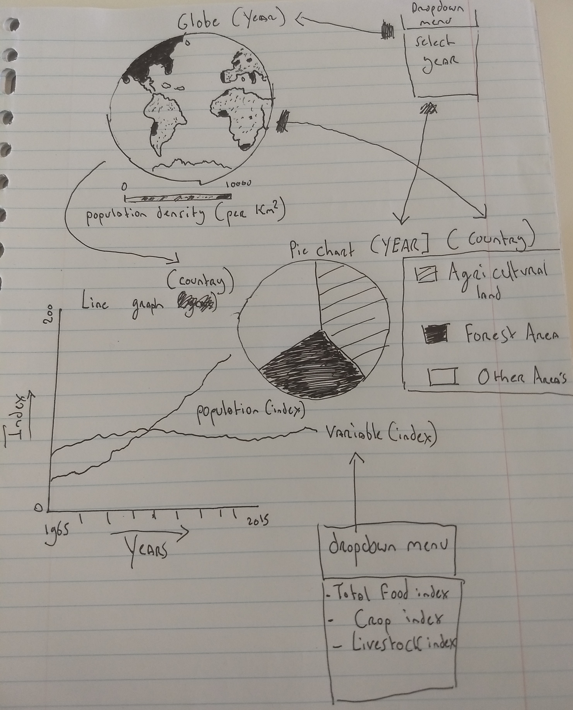

# project
## *Steven Kuhnen (10305882)*
# **Agriculture and Population growth: How sustainable is the current population growth**

## Problem Statement
The finished product will illustrate whether population growth is outpacing agricultural production in (some parts of) the world. In 1799 demographer Thomas Malthus predicted that in the future there will come a day when there is not enough food produced to feed everybody, and that too much land is being used for agriculture. People who are interested in sustainability will see whether there are any indications that indicate that Malthus might be right and that overpopulation is or will be a real problem.

## Solution
The visualizations will compare food production and population growth with a line graph, show how densely populated a country is, and how much land of a country is already being used for agriculture.

### Main features
- User can select from which year the data will be shown (Minimum viable product (MVP))
- Globe which will show 1) the population density of each country (MVP) or 2) the prevalence of undernourishment. User can choose which variable will be illustrated on the globe (Optional). The globe will update the other visualizations (MVP).
- Line graph, which will compare the total population with the total food produced per country over a couple of decades. User selects the country on the globe (MVP). User can also choose to compare population number with either crop or livestock production (Optional)
- Pie chart, which will illustrate how much land is being used already for agriculture in a certain country. Also shows decline in forest area, which can be a sign of overpopulation (MVP).

## Data Sources
Datasets from the World Bank (https://data.worldbank.org/indicator) will be used. All the datasets (csv-format) are user-friendly, and will thus need none to minimum editing before implantation.

### Datasets for the map/globe:
- Population density (people per sq. km of land area)
- Prevalence of undernourishment (% of population)

### Datasets for the pie chart
- Agricultural land (% of land area)
- Forest area (% of land area)

### Datasets for the line graph
- Population, total (note: index will be calculated and used for the line graph)
- Food production index (2004 – 2006 = 100)
- Crop production index (2004 – 2006 = 100)
- Livestock production index (2004 – 2006 = 100)

## External components (for now)
- D3 tip
- D3 topojson (https://github.com/topojson/topojson)
- Bootstrap

## Hardest parts
Working with a d3 globe will be challenging, because it is the central element of the linked views and because I have yet to work with something like a moveable d3 element. If it ends up being too difficult, I will instead visualize a static worldmap.

## Similar visualizations

