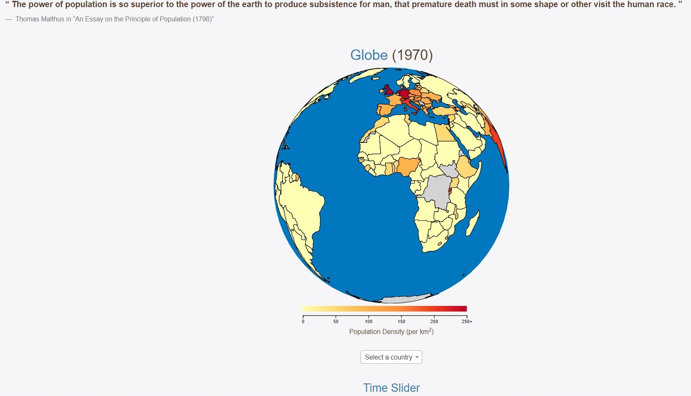
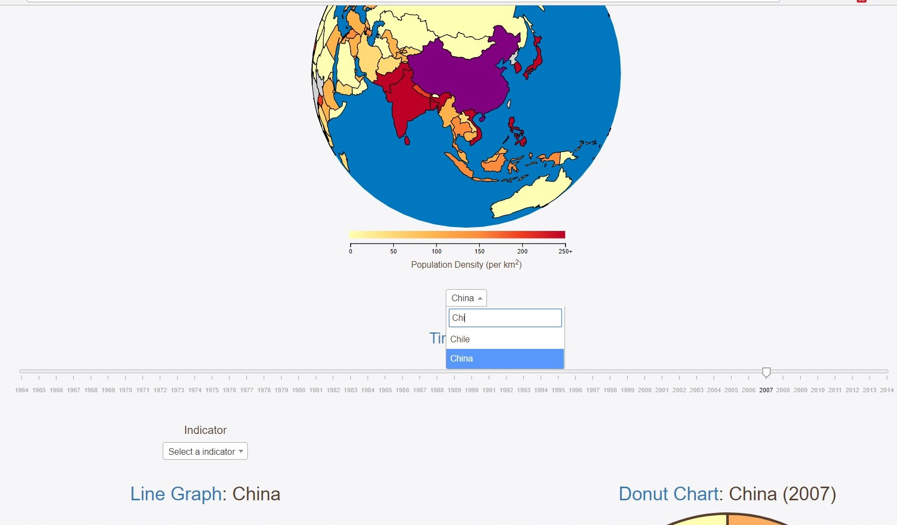
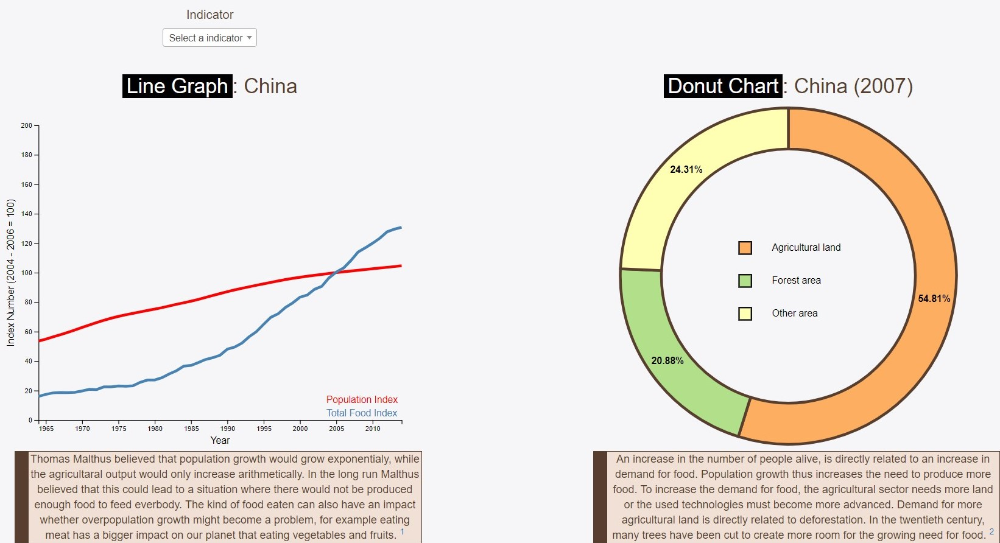
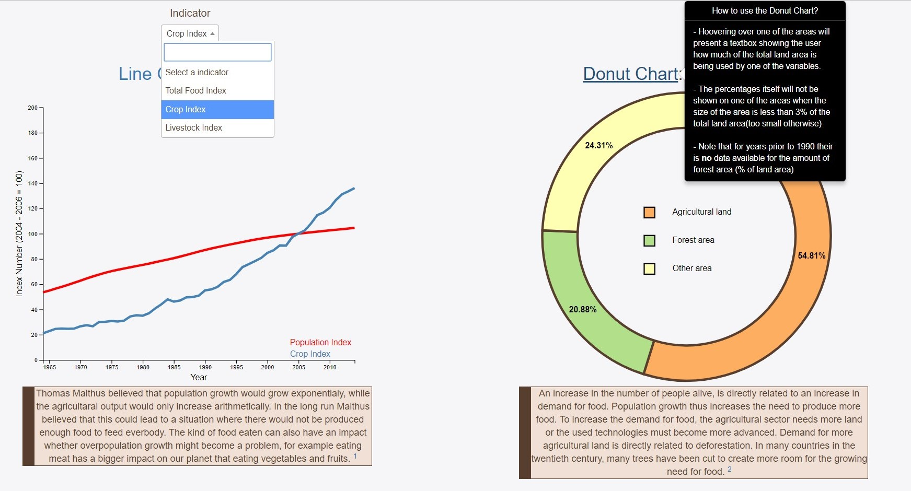

# Project
## *Steven Kuhnen (10305882)*
## **Agriculture and Population growth: How sustainable is the current population growth**

[Visit my Website!](https://stevenuva.github.io/project/)

### Introduction
In 1799 demographer Thomas Malthus predicted that in the future there will come a day when there will not be enough food produced to feed everybody, and that too much land is being used for agriculture. The website illustrates whether population growth is indeed outpacing agricultural production in (some parts of) the world.People who are interested in sustainability will see whether there are any indications that indicate that Malthus might be right and that overpopulation is or will be a real problem.

#### Main features

- Globe which will show the population density of a country when you click on acountry. The population density of a country in a certain year also determines with what color the country will be filled. The globe will also update the other visualizations when you click on a country.

- User can select from which year the data will be shown. This will update the donut chart and the globe.
- User can also select a country of which they want more information about by selecting the country in the dropdown menu.

- Line graph, which compares the total population with the total food produced per country over a couple of decades. User selects the country on the globe or in the dropdown menu beneath the globe.
- Donut Chart, which will illustrates how much land is being used in a certain year for agriculture in a certain country. Also shows decline in forest area, which can be a sign of overpopulation.

- User can also edit the variables being shown in the line graph. User can choose to replace the total food data with either crop- or livestock production data. This can be done by selecting a variable just above the line graph

- By hoovering over the title ("Globe", "Time Slider", "Donut Chart", "Line Graph"), the user activates a popover which gives instruction how to use the visualization.

### Data Sources
Datasets from the World Bank (https://data.worldbank.org/indicator) will be used. All the datasets (csv-format) are user-friendly, and will thus need none to minimum editing before implantation.

#### Datasets for the map/globe:
- [Population density (people per sq. km of land area)](https://data.worldbank.org/indicator/EN.POP.DNST?view=chart)

#### Datasets for the donut chart
- [Agricultural land (% of land area)](https://data.worldbank.org/indicator/AG.LND.AGRI.ZS?view=chart)
- [Forest area (% of land area)](https://data.worldbank.org/indicator/AG.LND.FRST.ZS?view=chart)

#### Datasets for the line graph
- [Population, total](https://data.worldbank.org/indicator/SP.POP.TOTL?view=chart) (note: index will be calculated and used for the line graph)
- [Food production index (2004 – 2006 = 100)](https://data.worldbank.org/indicator/AG.PRD.FOOD.XD?view=chart)
- [Crop production index (2004 – 2006 = 100)](https://data.worldbank.org/indicator/AG.PRD.CROP.XD?view=chart)
- [Livestock production index (2004 – 2006 = 100)](https://data.worldbank.org/indicator/AG.PRD.LVSK.XD?view=chart)

### External components (for now)
- Ajax
- Bootstrap v3
- jQuery
- D3 version 4
- D3 tip
- D3 topojson (https://github.com/topojson/topojson)
- Select2 library

### Copyright
