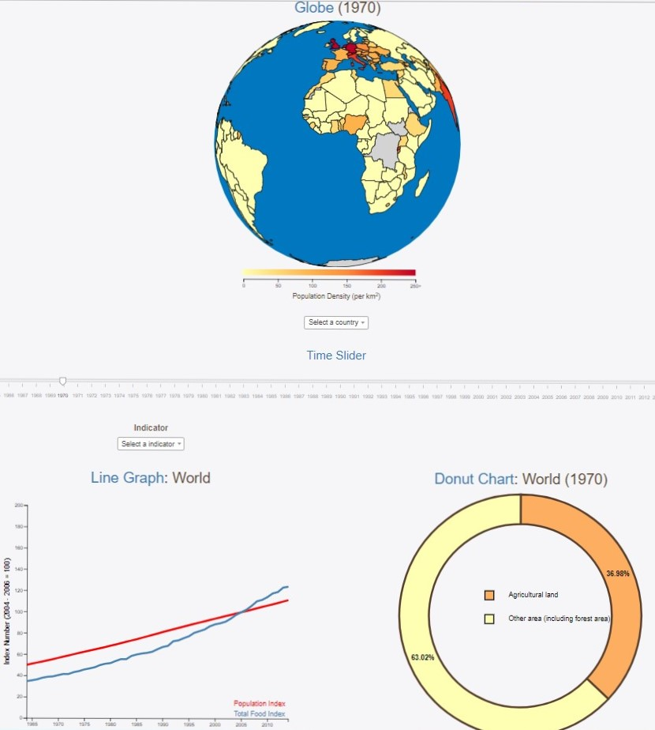

# Project Report
## *Steven Kuhnen (10305882)*

### Short Description

My website consist out of three main visualizations:
- 1) A globe
- 2) A line graph
- 3) A Donut Chart

Besides these three visualizations, there are also two dropdown menus (one to slect countries on the globe, and one to change the variables depicted on the linegraph) and a time slider. There is also a navbar at the top.

Note the screenshot does not show the whole webpage, just the main components (its too big for that).

### Technical Design: short overview

### Technical Design: detailed

### Challenges

### Looking back at my decisions

